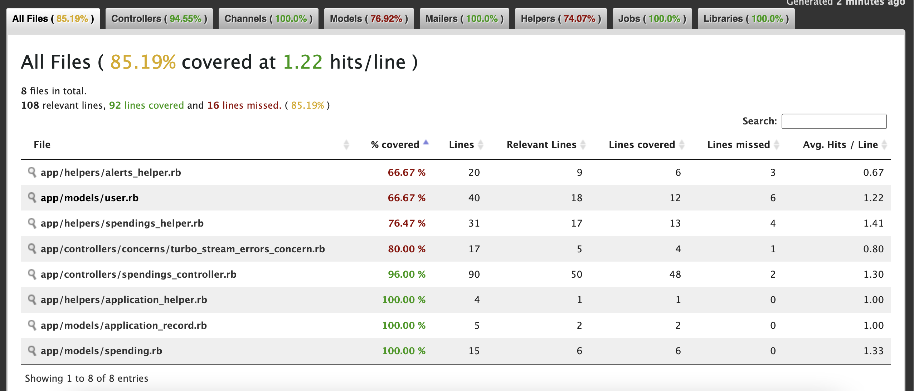

# README
# Info
This is an example rails application with the following functionality:
- User should be able to sign up and sign in with the login and password. - User should be able to add/edit/delete the spending inside the app.
- User should be able to see the list of his spendings with a total value, filter the list on several parameters (e.g., category, amount).
- User should be able to insert the description and amount for the spending entry.
- User should be able to choose the spending category from the given list (Traveling, Clothing, Taxi, Cafes, Shops, Other).
- User should be able to share the non-editable list of his spendings with another user.

Uses ruby 3.1.1, rails 7.0.4, Postges, slim, js and turbo_stream.
Deploy to heroku

## URL
https://desolate-reef-74003.herokuapp.com/

## How to run project first time

Add .env file (look at .env.example)
```
docker-compose -f "docker-compose.dev.yml" build
docker-compose -f "docker-compose.dev.yml" run web rake db:create
docker-compose -f "docker-compose.dev.yml" up
```

At this point, you should be able to navigate to http://localhost:3000
or http://192.168.99.100:3000 (Docker's default host)
in your local browser and see the app running.

To stop containers, use
```docker-compose -f "docker-compose.dev.yml" down```

You have to run
```docker-compose -f "docker-compose.dev.yml" build```
every time you add a new gem!

To use PgAdmin, go to localhost:5555, register server with 
hostname `host.docker.internal`
maintenance database `example_app_development`
username & password from `.env` `POSTGRES_USER_DEV` and `POSTGRES_PW_DEV`

## Push changes to heroku
Use `git push heroku main` to push main branch to Heroku
Use `heroku run rake db:migrate` to run migrations
Use `heroku open` to launch app in the browser
Use `heroku logs` to see the logs
Use `heroku run [command]` to run rails / rake commands

## Coverage


